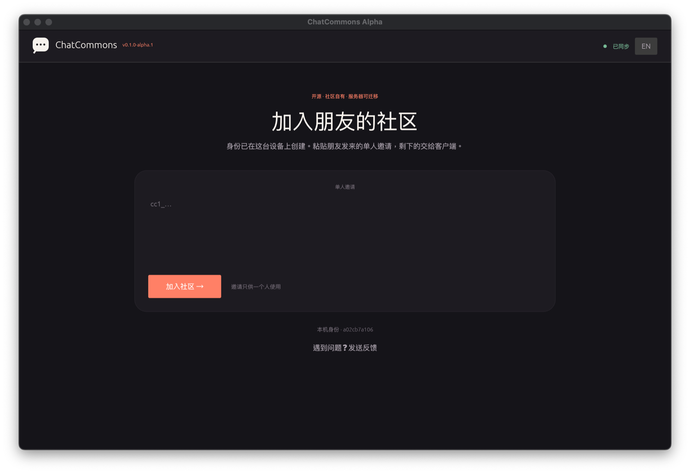
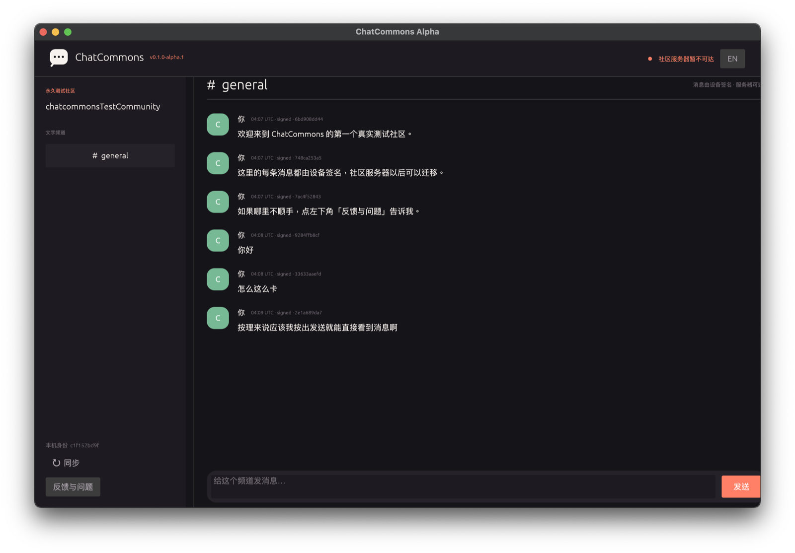
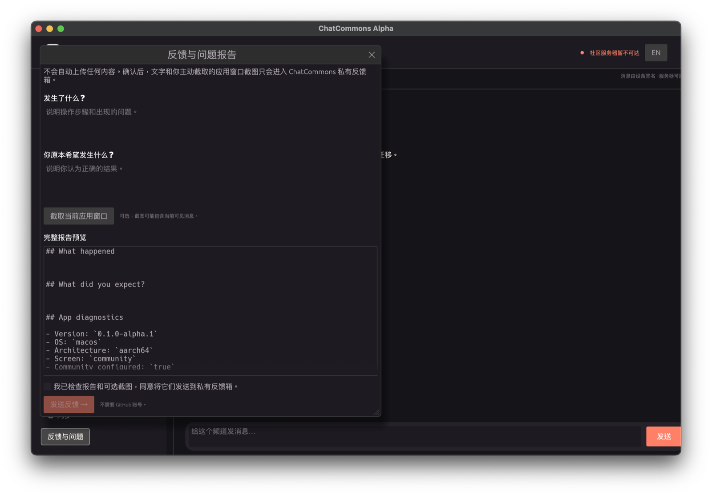

# ChatCommons

Current product version: `0.1.0-alpha.3` (friends-and-contributors alpha).
Product releases, wire protocol versions, storage schema versions, and server
deployment revisions are versioned independently. See
[docs/versioning.md](docs/versioning.md).

ChatCommons is an open, offline-first protocol for community-owned chat. Its
goal is simple: your community, your rules, your chat. The current workspace
contains protocol v2, one deliberately small reference chat profile, single-use
bearer invitations, secure invitation bootstrap, direct QUIC synchronization,
relay-assisted hole punching, and an owner-signed replaceable home-server
declaration with a bounded diagnostic authenticated Home Server process. The
workspace now also contains a minimal native protocol test shell and the start
of a shared browser/Tauri client UI. It contains no production hosted service,
trusted release binary, voice implementation, account recovery or multi-device
identity.

## Friends-alpha preview

The current native eframe shell is an intentionally small protocol alpha: it creates a
local test identity, joins a community with a one-person invitation, shows
validated signed messages, and sends text through the replaceable Community
Home Server. It is being replaced as the friend-facing surface by the shared
client UI defined in [ADR 0024](docs/adr/0024-single-client-ui-source.md). These
screenshots are development captures and will change.

| Join from an invitation | Signed community chat |
| --- | --- |
|  |  |



The in-app feedback form sends user-reviewed text and an optional,
explicitly-captured app-window screenshot to the private ChatCommons feedback
inbox. It does not require or create a public GitHub issue.

## Workspace

- `chatcommons-crypto`: Ed25519 identities and byte-level verification
- `chatcommons-cli`: Unix-only M2c-M3d diagnostic executables
- `chatcommons-protocol`: opaque signed envelopes, canonical encoding, parsing and IDs
- `chatcommons-storage`: idempotent SQLite event persistence
- `chatcommons-node-core`: generic DAG validation and local ingestion
- `chatcommons-profile-chat`: the optional `chatcommons.chat.v2` reference semantics
- `chatcommons-sync`: bounded DAG synchronization over direct or relayed connections
- `chatcommons-relay`: bounded, ephemeral development Circuit Relay v2 node
- `apps/client-ui`: single React/TypeScript UI for browser review and Tauri
- `apps/desktop`: temporary eframe protocol diagnostic shell

## M2c-M3d diagnostic node

The current executable is a developer connectivity tool, not an end-user client.
It persists plaintext development keys only on Unix, with a `0700` state
directory and `0600` identity file. Do not reuse these keys for high-value or
production identities.

```sh
cargo run --bin chatcommons-node -- init --state <node-a-directory>
cargo run --bin chatcommons-node -- init --state <node-b-directory>
cargo run --bin chatcommons-node -- create-community \
  --state <node-a-directory> --name "Friends"
```

Create a single-use invite containing node A's reachable QUIC address:

```sh
cargo run --bin chatcommons-node -- create-invite \
  --state <node-a-directory> \
  --community <community-id> \
  --address /ip4/<node-a-public-ip>/udp/4001/quic-v1
```

Start node A at the same address and let node B join using only `INVITE_CODE`:

```sh
cargo run --bin chatcommons-node -- run \
  --state <node-a-directory> \
  --community <community-id> \
  --listen /ip4/0.0.0.0/udp/4001/quic-v1

cargo run --bin chatcommons-node -- join \
  --state <node-b-directory> \
  --invite-code <cc1-code>
```

The code contains a bearer secret and the diagnostic CLI exposes it in terminal
and process arguments. Use development identities only. The command has no
discovery or production relay configuration. Mutating and long-running commands
hold an advisory per-state process lock; restrict the diagnostic listener to a
test environment. See
[ADR 0014](docs/adr/0014-m2c-diagnostic-node.md) and
[ADR 0015](docs/adr/0015-secure-invitation-bootstrap.md).

For a local Relay v2 fallback test, start the intentionally ephemeral diagnostic
relay and combine its printed listen address and Peer ID into a relay base:

```sh
cargo run --bin chatcommons-relay -- --listen /ip4/127.0.0.1/udp/4002/quic-v1
# relay base: <RELAY_LISTEN_ADDRESS>/p2p/<RELAY_PEER_ID>
# invite route: <relay-base>/p2p-circuit
```

Pass the base to `chatcommons-node run --relay-address <relay-base>` and put the
route in `create-invite --address <invite-route>`. The joiner first connects
through the relay, then rust-libp2p DCUtR attempts a direct QUIC upgrade; if that
attempt fails, the bounded relay circuit remains the fallback. The relay binary
has an ephemeral identity, no persistence and no production operating controls.
Do not expose it publicly. See
[ADR 0016](docs/adr/0016-relay-assisted-hole-punching.md).

## Diagnostic Community Home Server

Initialize a separate server state and copy its printed device key into an
owner-signed declaration:

```sh
cargo run --bin chatcommons-node -- init --state <server-directory>

cargo run --bin chatcommons-node -- set-home-server \
  --state <owner-directory> \
  --community <community-id> \
  --server-public-key <DEVICE_PUBLIC_KEY> \
  --endpoint /ip4/<server-ip>/udp/4001/quic-v1
```

Export the locally known, parent-closed signed community DAG, transfer the file
through an operator-controlled channel, and import it into the separately
initialized server state:

```sh
cargo run --bin chatcommons-node -- export-community \
  --state <owner-directory> \
  --community <community-id> \
  --output <community.ccarchive>

cargo run --bin chatcommons-node -- import-community \
  --state <server-directory> \
  --input <community.ccarchive>
```

The archive contains signed community events in plaintext but no user or server
identity seeds. The CLI creates it as a new `0600` file on Unix and refuses to
overwrite an existing path. Protect and remove operational copies according to
your own retention policy.

Start the persistent role:

```sh
cargo run --bin chatcommons-node -- serve-community \
  --state <server-directory> \
  --community <community-id> \
  --listen /ip4/0.0.0.0/udp/4001/quic-v1 \
  --max-store-bytes 536870912
```

A member whose database already contains the signed declaration can derive the
server Peer ID and select its declared Multiaddr automatically:

```sh
cargo run --bin chatcommons-node -- sync-home-server \
  --state <member-directory> \
  --community <community-id> \
  --listen /ip4/0.0.0.0/udp/0/quic-v1
```

Clients that know the declaration authenticate this exact server device without
making its operator a community member. The server accepts current members,
persists signed events in SQLite, and serves them when other members later come
online. It has a logical event-body storage quota, an exclusive state lock, a
least-privilege systemd template and operator-driven snapshot/restore scripts for
private Linux testing. It still has no per-peer persistent rate limit, scheduled
off-host backup, monitoring, endpoint discovery or attachment storage; do not
expose it as a public service. See
[ADR 0018](docs/adr/0018-minimal-community-home-server.md) and
[ADR 0019](docs/adr/0019-bounded-community-archives-and-declared-dialing.md),
[ADR 0020](docs/adr/0020-private-home-server-runtime-boundaries.md),
[ADR 0021](docs/adr/0021-private-server-snapshots.md) and the
[private deployment guide](deploy/README.md).

The fallback path has also completed a physical cross-NAT measurement between a
macOS hotspot client and Windows/WSL on a separate home connection. The direct
candidate timed out for that NAT combination, while invitation
bootstrap and SQLite convergence completed over a third-party Relay v2 node.

Run all quality gates:

```sh
cargo fmt --all -- --check
cargo build --workspace --all-targets
cargo clippy --workspace --all-targets -- -D warnings
cargo test --workspace --all-targets
```

Core verifies cryptographic facts; profiles decide what those facts mean. See
[docs/protocol.md](docs/protocol.md) and
[ADR 0007](docs/adr/0007-less-is-more-core-profile-boundary.md). The current
interoperability fixture is
[docs/test-vectors/core-v2-genesis.json](docs/test-vectors/core-v2-genesis.json).
The v1 fixture remains available as historical test material only.

The reference product has two compatible use cases: durable communities provide
stable membership and replicated history; temporary rooms will later provide
low-friction voice and screen sharing without durable history. Only the durable
text-community foundation is implemented today. See
[ADR 0013](docs/adr/0013-durable-communities-and-temporary-sessions.md).

Security and governance baselines live in
[docs/security/threat-model.md](docs/security/threat-model.md),
[docs/governance/control-boundaries.md](docs/governance/control-boundaries.md), and
[docs/governance/china-launch-checklist.md](docs/governance/china-launch-checklist.md).
The executable go/no-go checklist is
[docs/governance/engineering-gates.md](docs/governance/engineering-gates.md).
